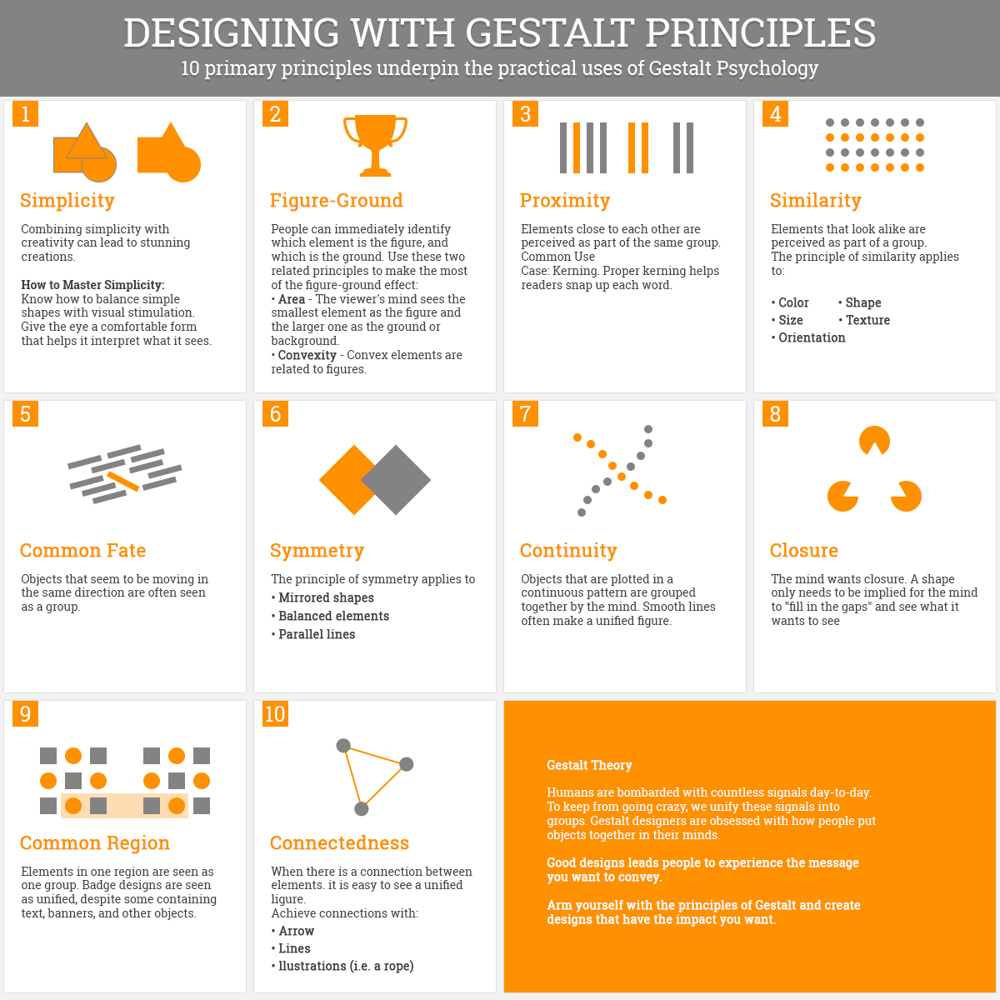
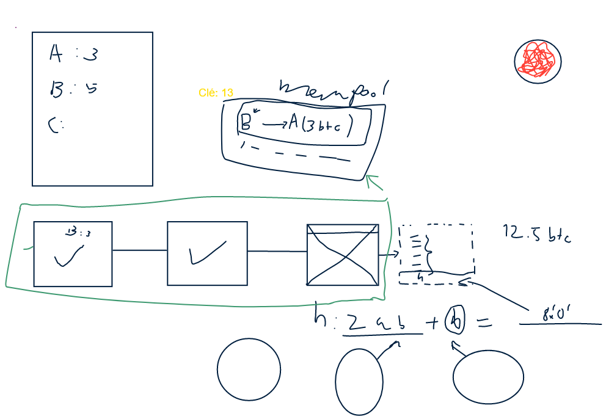

# Introduction
Ce projet a été développé afin de répondre aux exigences d'un mini-projet pour le cours Vi du Master MSE.
Ce cours demande de créer un programme permettant de visualiser des informations.

# Histoire derrière ce programme
Avec l'avancement constant de la cryptomonnaie et le besoin insatiable d'anonymat, la cryptomonnaie prend une place essentielle à tout achat en ligne.

Cependant, pour qu'une personne utilise cette monnaie virtuelle, il est nécessaire de connaître son fonctionnement avant.

Notre programme répondra donc aux questions :
- Est-ce que cette monnaie est falsifiable ?
- Comment fonctionne une blockchain ?
- Quels sont les liens entre les différents blocs ?
- Comment se visualiser simplement une blockchain ?

De plus, afin de répondre aux exigences du cours, notre programme contient également :
- Un concept intéressant
- Une argumentation sur le sujet simple à interpréter
- Une réalisation par groupe de 3 personnes avec une gestion de projet (Trello, Jira, ...)
- Permettre d'interagir avec notre programme afin de détailler les informations visualisées
- Une documentation expliquant:
    - l'utilisation du programme
    - notre motivation
    - l'histoire que notre programme apporte
    - la problématique de départ
    - notre public cible
- Quelles informations avons-nous utilisées afin de réaliser ce projet (références) ?
    - <a href="https://bitcoin.org/bitcoin.pdf">https://bitcoin.org/bitcoin.pdf</a>, que nous avons simplifié
- Volume de travail

# Motivation
Il se trouve que deux de nos membres connaissaient les monnaies virtuelles et que l'un d'eux les utilise fréquemment. Notre désir était tout d'abord d'apprendre à notre collègue le fonctionnement derrière cette monnaie et réussir à créer une visualisation qui permettra à d'autres personnes externes d'y parvenir également.

# Utilisation du programme
Le programme est disponible en ligne avec le lien: <a href="https://cypttagpu.github.io/ViCoin-App/">https://cypttagpu.github.io/ViCoin-App/</a>.
L'utilisation est très simple: "Cliquez sur les boutons pour afficher des détails". Ce n'est pas plus compliqué.

# Problématique de départ
Notre problématique de départ est: `Comment fonctionne une blockchain et comment peut-on interagir avec elle ?`

# Public cible
Nous ciblons les personnes qui souhaiteraient utiliser une monnaie virtuelle (comme le Bitcoin, Éther ...) et souhaiteraient, afin d'y parvenir, comprendre le fonctionnement derrière ce type de monnaie: "La blockchain".

# Principes du cours mis en pratique dans ce projet
Notre programme a pour but de permettre de visualiser mentalement le fonctionnement d'une cryptomonnaie (Slide 17 du Cours 3 sur les représentations mentales). 

Afin d'y parvenir, nous avons utilisé les règles de Gestalt suivantes:
- 2: Figure-Ground (Une empreinte (sur les blocs) qui peut être comparée à des hashs.)
- 4: Similarity (Plusieurs blocs/rectangles forment un ensemble: Une "Blockchain".)
- 5: Common fate (Les blocs bougent en même temps et dans la même direction comme s'il faisait partie d'un ensemble: une "Blockchain".)
- 7: Continuity (Ils sont également alignés pour permettre de les considérer comme groupés.)
- 9: Common region (Nous regroupons également les blocs dans une zone afin qu'il soit perçu comme un groupe.)
- 10: Connectness (Les blocs sont liés avec une ligne permettant de visualiser l'apparence d'une "Blockchain" et montrer que les blocs sont liés par leur hash.)

Pour développer le système, le programme utilise la technologie "p5.js" à laquelle nous avions pensé depuis le cours 5 durant l'explication "Processing" (Slide 9 à 12).
Son fonctionnement est très simple et permet de visualiser des données rapidement et efficacement.
En apprenant la technologie, nous avons mis en place 2 catégories d'interactions (Cours 5 à la slide 8, "Stalko 2007"):
- Abstract/Elaborate: Permettre d'afficher les données dans nos blocs en cliquant sur eux
- Explore: Permettre d'ajouter des éléments dans la liste de transactions pour voir nos propres transactions circuler dans le système.
Afin de trier nos données et les comparer simplement, nous utilisons également "plot.ly" qui nous permet de mettre en place des graphiques.

Il était important pour nous de conserver ce système sous forme de simulateur, cependant nous cherchions également à rendre ce système ludique afin de permettre d'avoir une certaine satisfaction.
De plus, nous avons décidé de simplifier l'algorithme de cryptomonnaie pour faciliter la compréhension et la mémorisation de nos utilisateurs (Slide 9 du cours 7).

Toute notre mise en place a été mûrement réfléchie avant d'être réalisée. Après avoir décidé du sujet, nous avons décidé de son contenu et de son apparence en faisant une maquette/Mockup (Slide 17 du cours 7) avec un Whiteboard collaboratif.

Le principe utilisé pour la visualisation était d'avoir un point de vue global ("Overview") et détaillé par interactions (Slide 19 et 20 du cours 8).

# Fonctionnalités du projet
- Visualisation d'une blockchain interactive et animée
- Permettre de créer des transactions avec une monnaie virtuelle
- Permettre de gagner de l'argent en minant du ViCoin
- Permettre de détailler les données dans chaque bloc
- Permettre de modifier les données et voir la raison pour laquelle les données ne sont pas falsifiables
